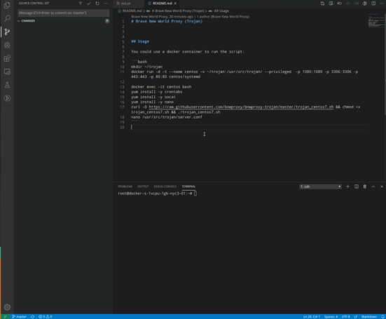

# Brave New World Proxy (Trojan)



## Usage

You could use a docker container to run the script:

```bash
mkdir ~/trojan
docker run -d -t --name centos -v ~/trojan:/usr/src/trojan/ --privileged  -p 1080:1080 -p 3306:3306 -p 443:443 -p 80:80 centos/systemd

docker exec -it centos bash 
yum install -y crontabs
yum install -y socat
yum install -y nano
curl -O https://raw.githubusercontent.com/bnwproxy/bnwproxy-trojan/master/trojan_centos7.sh && chmod +x trojan_centos7.sh && ./trojan_centos7.sh
nano /usr/src/trojan/server.conf
```
